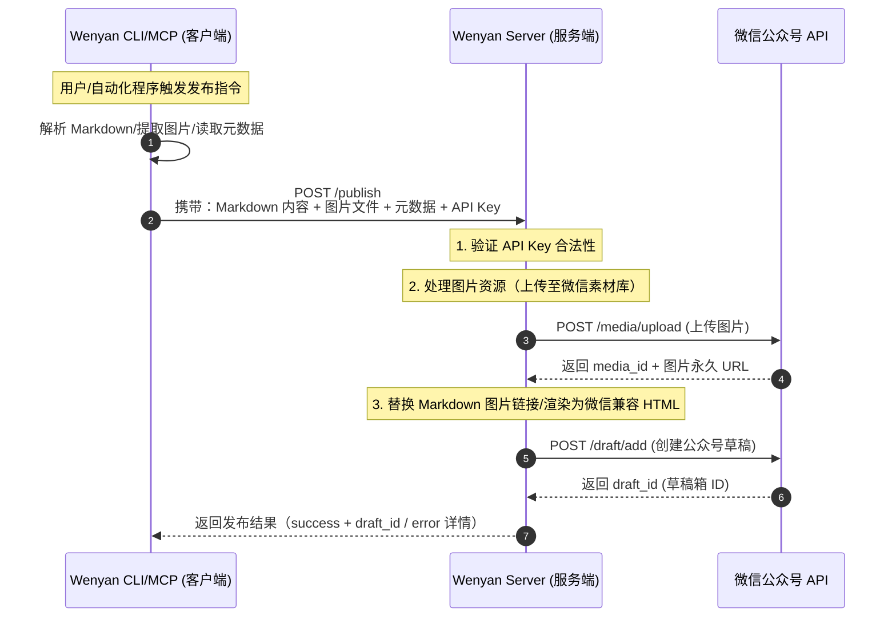

# 文颜 Server 模式文档

Server 模式是文颜专为「多公众号管理、无固定 IP 环境、自动化发布」设计的服务端部署方案，核心解决以下痛点：

- 本地设备无固定公网 IP，无需频繁添加微信公众号 API 白名单
- 统一管理多个公众号账号，避免多端重复配置
- 支持自动化、 CI/CD、AI 自动发文等规模化发布场景

## 核心架构

文颜 Server 作为中间层承接客户端请求，统一处理与微信公众号 API 的交互，架构流程如下：



文颜 Server 部署后暴露标准 HTTP 接口，支持 Wenyan CLI、Wenyan MCP 等客户端调用，适配自动化发布、批量发文、AI 生成后直接发布等场景。

## 快速部署

在一台有固定 IP 的服务器或云服务器上，先执行安装命令：

```bash
# 全局安装 Wenyan CLI（包含 Server 功能）
npm install -g @wenyan-md/cli

# 验证安装成功
wenyan --version
```

启动服务：

```bash
# 基础启动（默认端口 3000，无 API 鉴权）
wenyan serve

# 自定义端口 + 开启 API 鉴权（推荐生产环境）
wenyan serve --port 8080 --api-key your-secret-api-key-123456
```

### 启动参数说明
| 参数              | 简写 | 说明                                                                 | 必填 | 默认值       |
|-------------------|------|----------------------------------------------------------------------|------|--------------|
| --port            | -   | 指定服务端口                   | 否  | 3000            |
| --api-key            | -   | 设置全局 API 密钥（开启鉴权），客户端请求需携带`x-api-key`头                  | 否  | -            |

## 环境变量设置

如果你只使用一个公众号进行发布，可以在服务器环境中添加以下环境变量：

```bash
export WECHAT_APP_ID=xxx
export WECHAT_APP_SECRET=xxx
```

这样在调用`publish`接口时就无需传递`wechat_app_id`和`wechat_app_secret`参数。

## API 接口设计

所有的内容接口采用流式上传（支持 10MB），安全且高效。如果设置了鉴权，请在 Header 中携带 `x-api-key: your-api-key`。

### 1. 健康检查

```bash
curl http://localhost:3000/health
```

### 2. 文件/图片上传接口

支持上传图片和 Markdown 文件。上传后，文件将被安全地存储在服务器临时目录（10分钟后自动回收），并返回供下一步使用的 `fileId`。

```bash
# 上传 Markdown 或 图片
curl -X POST http://localhost:3000/upload \
  -H "x-api-key: my-secret-key" \
  -F "file=@/path/to/article.md"
```

响应示例：

```json
{
  "success": true,
  "data": {
    "fileId": "550e8400-e29b-41d4-a716-446655440000.md",
    "originalFilename": "article.md",
    "mimetype": "text/markdown",
    "size": 1024
  }
}
```

### 3. 远程发布接口

使用上传阶段获得的 `fileId` 触发服务端的排版渲染和微信发布流程。服务端会自动读取暂存的文件内容并发布。

```bash
curl -X POST http://localhost:3000/publish \
  -H "x-api-key: my-secret-key" \
  -H "Content-Type: application/json" \
  -d '{
    "fileId": "550e8400-e29b-41d4-a716-446655440000.md",
    "theme": "default",
    "highlight": "solarized-light",
    "macStyle": true
  }'
```

## API 接口认证

当服务启动时指定`--api-key`参数，所有接口（除`/health`）均需通过 API Key 认证：

- 客户端在请求 Header 中添加 `x-api-key`: 你的服务端密钥
- 服务端验证 Header 中的密钥与启动时设置的密钥是否一致
- 验证失败则返回 `401 Unauthorized`，验证通过才处理请求

## 多公众号配置（进阶）

TODO
